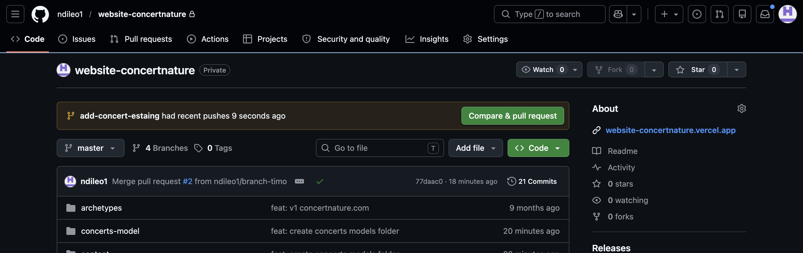
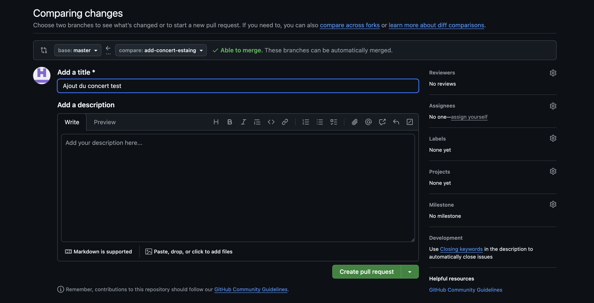
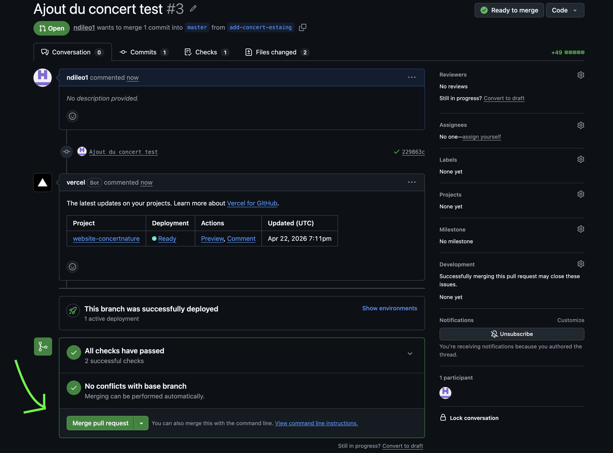
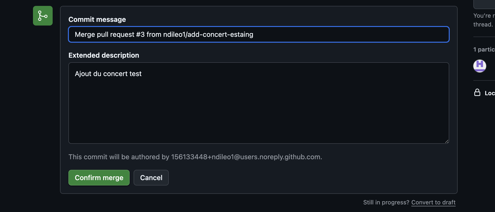

# 🎹 Procédure pour ajouter un concert

Bonjour jeune padawan ! ✋  
Voici le guide étape par étape pour ajouter un nouveau concert sur ton site. Suis bien chaque point pour que tout fonctionne parfaitement.

---
## 🏗️ Étape 0 : Vérifier que je n'ai pas de modification en cours 

```bash
git status
```

## A faire si pas de modification et que je suis pas sur la branche "master"
```bash
git checkout master
git pull
```

## 🏗️ Étape 1 : Préparation du contenu

1. **Trouver les modèles** : Va dans le dossier `concerts-model`. Tu peux rajouter des modèles si besoin.
2. **Copier** : Copier les 2 fichiers (`en-xxxx.md` et `fr-xxxx.md`) du concert que tu veux ajouter.
3. **Coller** : Mets-les dans les dossiers de destination :
   - `content/en/post/` (pour la version anglaise)
   - `content/fr/post/` (pour la version française)

> [!IMPORTANT]
> **Format de la date (ISO 8601)**
> La date doit être écrite exactement comme ceci : `2026-04-25T23:59:00`
> - `2026-04-25` : Année-Mois-Jour (À modifier selon ton concert)
> - `T` : Séparateur (Ne pas toucher)
> - `23:59:00` : L'heure (Ne pas modifier l'heure, cela permet un affichage correct)

4. **Modifier** : Change les images, le lieu et la description à l'intérieur des fichiers selon tes besoins. 📝

---

## 💻 Étape 2 : Commandes Git (Sur ton ordinateur)

Ouvre ton terminal et tape ces commandes une par une :

### 1. Créer une nouvelle branche
```bash
git checkout -b add-concert-nom-du-concert
```
*(Remplace `nom-du-concert` par le nom du lieu, ex: `add-concert-estaing`)*

### 2. Enregistrer les modifications
```bash
git add .
```

### 3. Valider (Commit)
```bash
git commit -m "Ajout du concert : nom-du-concert"
```

### 4. Envoyer sur GitHub
```bash
git push -u origin add-concert-nom-du-concert
```

---

## 🌐 Étape 3 : Mise en ligne sur GitHub

Maintenant, tout se passe sur internet !

1. Va sur [github.com/ndileo1/website-concertnature](https://github.com/ndileo1/website-concertnature).
2. Clique sur le bouton jaune **"Compare & pull request"**.
   
3. Clique sur le bouton vert **"Create pull request"**.
   
4. **Fusionner (Merge)** : Une fois la Pull Request créée, clique sur **"Merge pull request"**.
   
5. **Confirmer** : Enfin, clique sur **"Confirm merge"**.
   

---

## ✅ Étape 4 : Terminer proprement

Bravo ! Ton site est en ligne. ✨  
Dernière petite chose à faire sur ton ordinateur pour que tout soit propre :

```bash
git checkout master
git pull
```

---

*Bonne route l'artiste !* 🎹🏔️